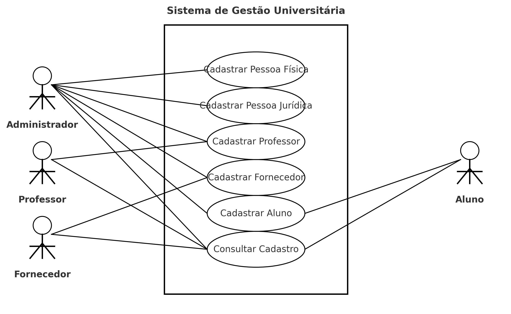
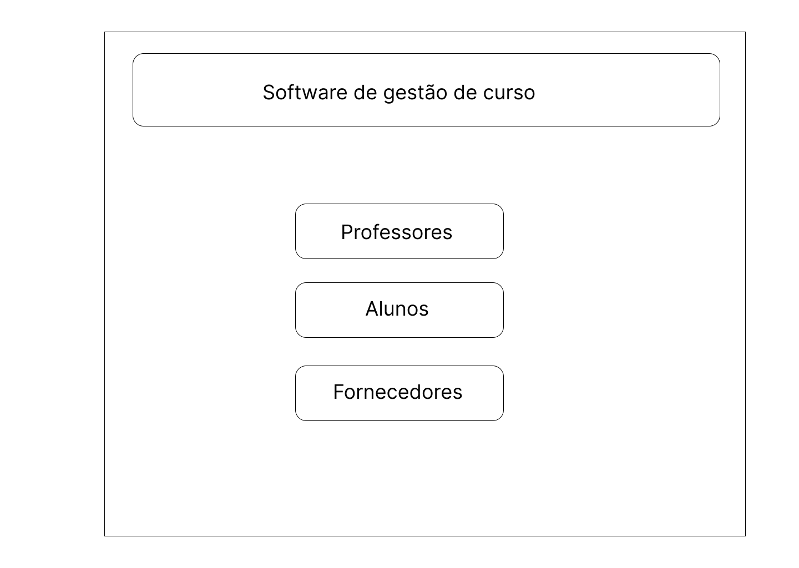
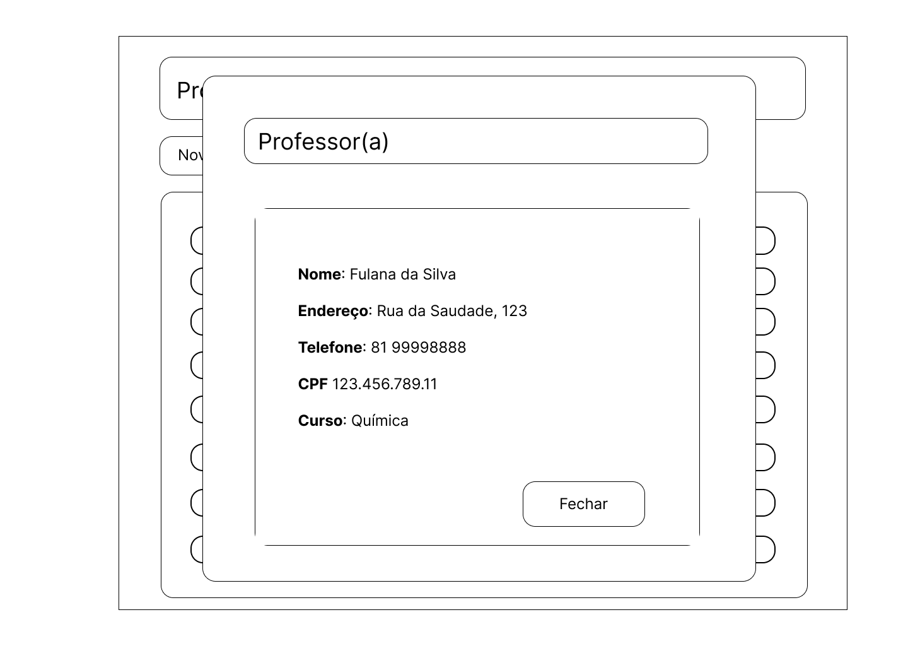
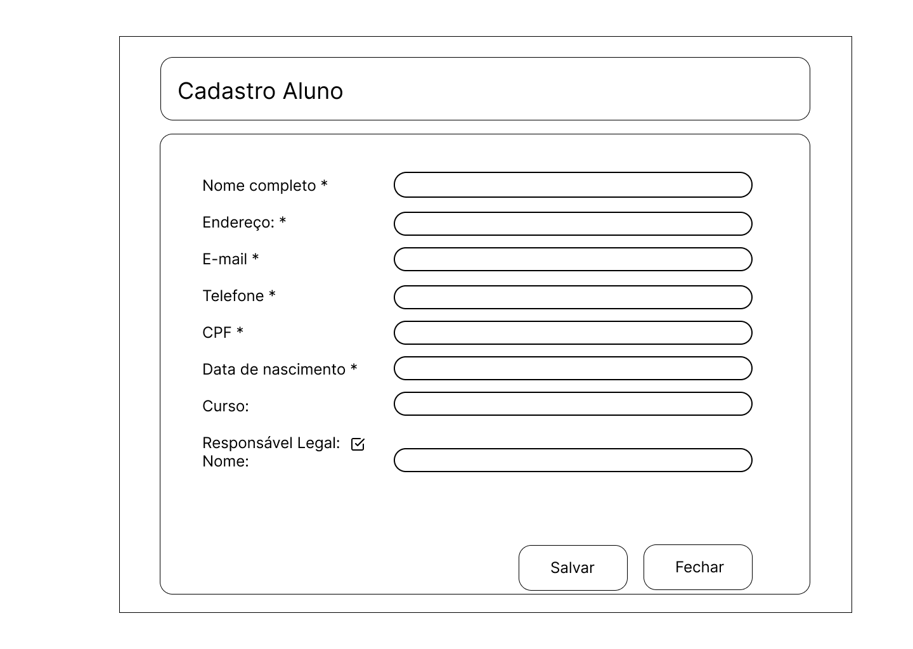
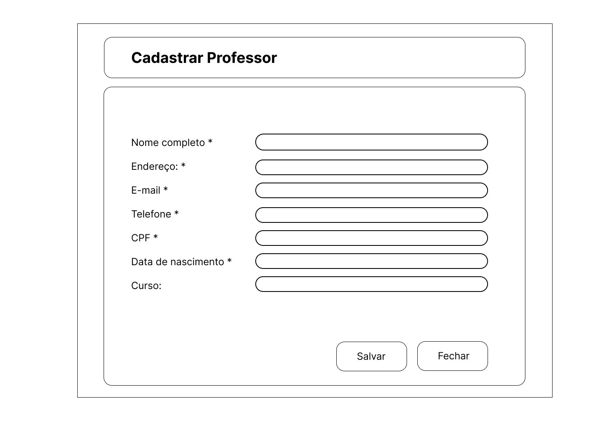
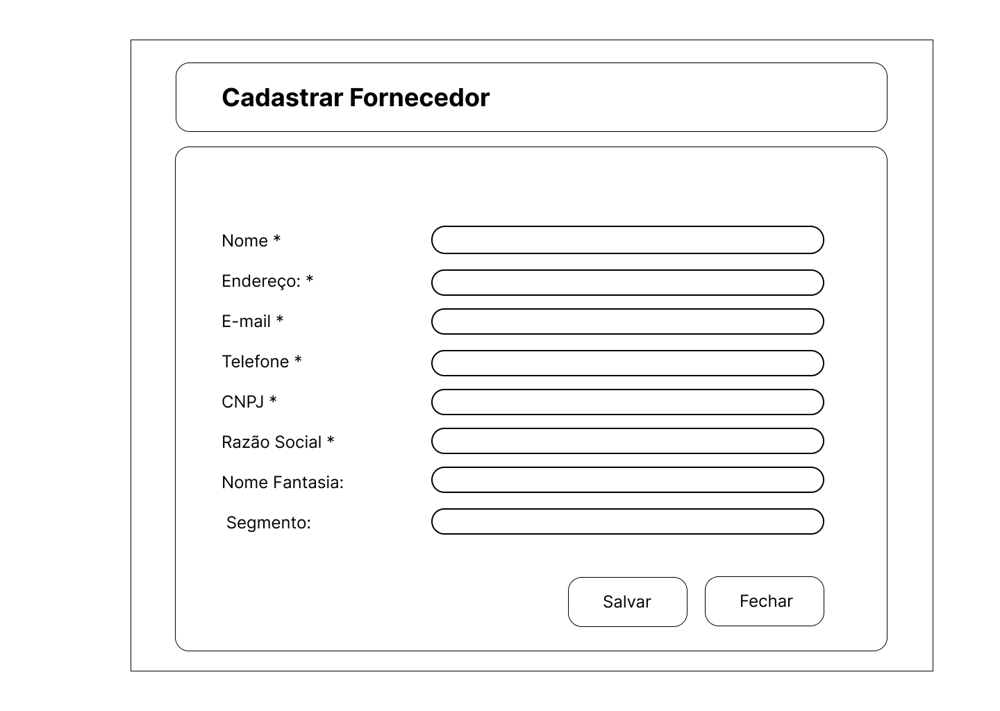
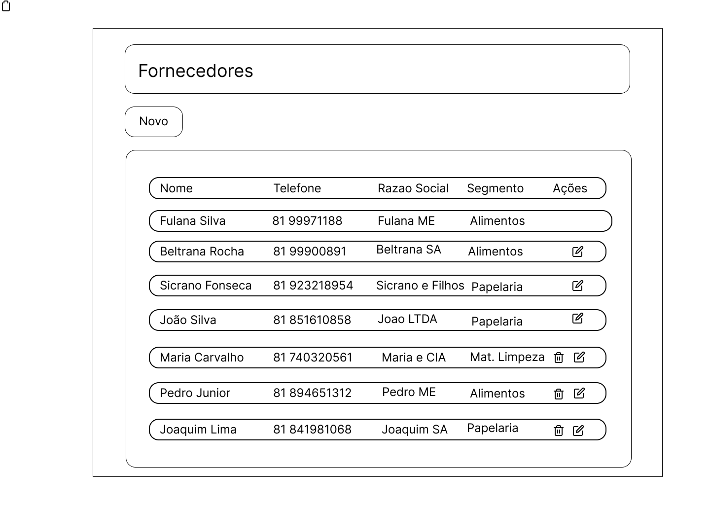
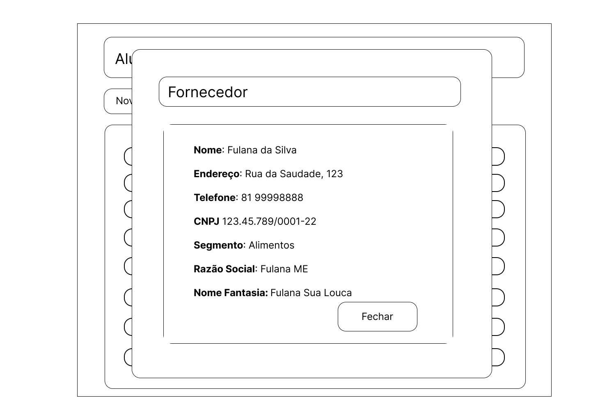

# Projeto Integrador - Grupo 11

**Curso:** Tecnologia em Análise e Desenvolvimento de Sistemas - Senac EAD  
**Tema:** Modelagem e Prototipação de Sistema Orientado a Objetos  

## Integrantes

- Roberto da Rosa Borges Fonseca Lima  
- Eduardo Bruno do Nascimento Cruz  
- Karoline Marta Marques Moura Marwell  
- Laísse de Carvalho Moura  
- Vinícius Serafim  
- Fernanda Fujishima  
- Pedro Henrique Oliveira Fernandes  

---

## Fase 1 - Modelagem (Diagramas UML)

- **Diagrama de Caso de Uso**  

- **Diagrama de Classes**  

 Documento completo: [PIGrupo11.docx](fase1/PIGrupo11.docx)

---

## Fase 2 - Protótipos da Interface

- **Home**  

- **Professores (lista)**  

- **Alunos (lista)**  

- **Cadastro de Aluno**  

- **Cadastro de Professor**  

- **Cadastro de Fornecedor**  

- **Fornecedores (listas)**  
  

---

## Repositório

Todos os integrantes têm acesso como colaboradores.  
